# Backend Architecture & AI Agents V2

This document serves as the comprehensive "Brain Manual" for the Lookfor project. It details the decision-making logic, external integrations, error handling protocols, and observability features of the AI system.

---

## 1. High-Level Concept: The AI "Call Center"

We have architected the system as a **Virtual Call Center** staffed by specialized agents. This is not a single generic chatbot, but a coordinated team of 5 distinct "Employees":

| Agent Role | Responsibility |
| :--- | :--- |
| **👩‍💼 The Router** | The "Receptionist". Listens to the first message, classifies intent, and seamlessly transfers the user to the correct specialist. Uses Regex fallbacks for reliability. |
| **📦 Order Manager** | Tracks shipments, handles "Where is my order?", and allows modifications (address changes) if unfulfilled. |
| **💰 Refund Specialist** | Handles damaged items & refund requests. Prioritizes replacements > store credit > cash refunds. |
| **🔄 Subscription Manager** | Retention specialist. Uses a "SAVE" funnel (Skip > Pause > Discount) before allowing cancellation. |
| **🛍 Sales & Product** | Product expert. Answers FAQs, explains how-to-use, and issues replacement discount codes for failed promos. |

---

## 2. Technical Architecture (LangGraph)

The backbone of this system is **LangGraph**. It replaces fragile "prompt chains" with a robust **State Machine**.

### The Graph Topology

```mermaid
graph TD
    Start((START)) --> Router[Router Detection]

    %% Router Decisions
    Router -- "ORDER_MANAGEMENT" --> OrderAgent[📦 Order Agent]
    Router -- "RESOLUTION_REFUND" --> RefundAgent[💰 Refund Agent]
    Router -- "SUBSCRIPTION_RETENTION" --> SubAgent[🔄 Retention Agent]
    Router -- "SALES_PRODUCT" --> SalesAgent[🛍 Sales/Product Agent]

    %% Cyclic Execution (The Brain Loop)
    OrderAgent <-->|Cycle| ToolNode[🔧 Tool Executor]
    RefundAgent <-->|Cycle| ToolNode
    SubAgent <-->|Cycle| ToolNode
    SalesAgent <-->|Cycle| ToolNode

    %% External Systems
    ToolNode <-->|API Calls| Shopify[Shopify API]
    ToolNode <-->|API Calls| Skio[Skio Subscription API]

    %% Termination
    OrderAgent --> End((END))
    RefundAgent --> End
    SubAgent --> End
    SalesAgent --> End
```



### Safety Mechanisms

1.  **Recursion Limits:** The graph allows up to **100 steps** per turn. This prevents infinite loops while allowing complex multi-step reasoning (e.g., Check Order -> Failed -> Check Email -> Found).
2.  **State Persistence:** The `AgentState` object persists across steps, carrying:
    *   `messages` (Complete history)
    *   `intent` (The active "department")
    *   `customerInfo` (User context)
    *   `logs` (Debug traces)

---

## 3. Robust Error Handling & "Sanitization"

A critical feature of V2 is how it handles failures. We do not expose raw JSON errors to the user.

### Layered Defense Strategy

1.  **Schema Flexibility (Zod):**
    *   Tools are defined with **flexible schemas** (e.g., `.nullable().optional()`).
    *   If the AI sends `null` for an optional field (like `note` or `shippingAddress`), the system auto-corrects it to `undefined` instead of crashing.

2.  **API "Sanitization" Layer (`route.ts`):**
    *   The API route wraps the entire execution in a `try/catch` block.
    *   **Interceptor:** If a technical error occurs (e.g., Zod Validation, Network Timeout), it intercepts the scary error message.
    *   **Sanitized Output:** Returns a polite message to the frontend: *"Veri kaynağına erişirken teknik bir sorun yaşadım. Lütfen tekrar deneyin."*

---

## 4. Observability & Logs (Frontend Feedback)

Unlike black-box AIs, our system provides "X-Ray Vision" to the frontend UI via **Real-time Logs**.

### The Log Protocol

When the AI works, it generates a parallel stream of "Logs" that the UI renders as status bubbles (e.g., "Checking Inventory...", "Processing Refund...").

**Payload Example:**

```json
{
  "type": "tool_call",
  "name": "shopify_get_order_details",
  "args": { "orderId": "1001" }
}
```

### Deep Tracing (LangSmith)

For developer debugging, we use **LangSmith Tracing**.
*   **Deep Inspection:** Allows us to see the exact prompt sent to the LLM, the token count, and latency.
*   **Environment:** Configured via `LANGCHAIN_TRACING_V2=true` in `.env.local`.

---

## 5. Agent "Personalities" & Rules

### 📦 Order Management
*   **The "3-Day Rule":** If tracking says "Delivered" < 3 days ago but user claims missing, it politely asks to wait (standard carrier buffer).
*   **Address Changes:** Only allowed for `UNFULFILLED` orders.

### 💰 Resolution & Refund
*   **Value Preservation:**
    1.  **Offer Reshipment:** "I can send a new one immediately."
    2.  **Offer Store Credit:** "I can give you a 110% refund in Store Credit."
    3.  **Cash Refund:** "Okay, resolving to original payment method."

### 🔄 Subscription Retention
*   **The Workflow:** Cancel Request -> "Why?" -> Offer Skip -> "No?" -> Offer Discount -> "No?" -> Cancel.
*   **Goal:** Maximize LTV (Lifetime Value) by retaining the user on ANY terms, even paused.

---

## 6. How to Add New Capabilities

To extend the brain:

1.  **Define Tool:** Write the TypeScript function in `src/tools/shopifyTools.ts`.
2.  **Wrap Tool:** Create a LangChain `tool()` wrapper in `src/lib/agents/tools.ts` with a **Zod Schema**.
3.  **Register:** Add it to the `ALL_TOOLS` array.
4.  **Teach:** Add a line to the relevant Agent's System Prompt (e.g., "You can now check loyalty points using `check_points` tool.").

---
This architecture ensures high reliability, user-friendly error handling, and a scalable foundation for future AI features.
