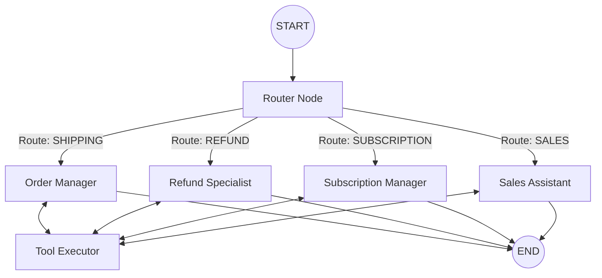

# Backend Architecture & AI Agents Documentation

This document explains the "Brain" of the Lookfor project. It details how the AI decides what to do, how it talks to external systems (Shopify/Skio), and how it reports its actions back to the Frontend.

---

## 1. Simple Concept: How it Works

Think of this system as a **Customer Support Call Center** with a team of 5 smart employees:

1.  **The Receptionist (Router):** Picks up the phone, listens to the user, and decides which department should handle it.
2.  **Order Manager:** Handles "Where is my stuff?" and address changes.
3.  **Refund Specialist:** Handles "My item is broken" or "I want my money back".
4.  **Subscription Manager:** Handles "Cancel my subscription" (and tries to convince them to stay).
5.  **Sales Assistant:** Handles "Does this code work?" or "How do I use this?".

**The Workflow:**

1.  User sends a message.
2.  **Router** analyzes it and forwards it to the right **Agent**.
3.  **Agent** thinks. If it needs data (like order status), it uses a **Tool**.
4.  **Tool** fetches data from Shopify/Skio.
5.  **Agent** reads the data and formulates a final answer.
6.  System returns the **Answer** AND a **Log** of what it did (for the UI to show).

---

## 2. Technical Architecture (LangGraph)

We use **LangGraph** to build this flow. It's like a state machine or a metro map where the conversation travels between nodes.



---

## 3. Logging & UI Feedback (Crucial)

Unlike standard chatbots that just sit silently while loading, our backend provides **Real-time Activity Logs**. This allows the Frontend to show users exactly what the bot is doing (e.g., "Checking order status...", "Applying discount...").

### How Logging Works

1.  When an Agent decides to call a tool, the LLM generates a `tool_call`.
2.  The system executes the function and generates a `tool_output`.
3.  **In `route.ts`**, we scan the entire conversation history _after_ the execution.
4.  We extract these invisible steps and format them into a `logs` array for the Frontend.

### Log Object Structure

Using these logs, the Frontend can display "Thinking..." bubbles or status steps.

**Example 1: The Bot is calling a tool**

```json
{
  "type": "tool_call",
  "calls": [
    {
      "name": "shopify_get_order_details",
      "args": { "orderId": "1001" }
    }
  ]
}
```

**Example 2: The Tool finished running**

```json
{
  "type": "tool_output",
  "name": "shopify_get_order_details",
  "content": "Status: Delivered, Date: 2023-10-10..."
}
```

---

## 4. The Agents (Detailed Rules)

### 👮 Main Router (`routerAgent.ts`)

- **Job:** Classify intent.
- **Intelligence:** Uses GPT-4o-mini implies context.
- **Fail-safe:** If AI is unsure, it uses Regex (keyword matching) to ensure the user always gets to a destination.

### 📦 Order Management Agent (`orderManagementAgent.ts`)

- **Job:** Shipping Status & Order Edits.
- **Special Rules:**
  - **The "3-Day Rule":** If an order is marked "Delivered" less than 3 days ago but user says "Not received", it strictly advises waiting 24 more hours (carriers often mark early).
  - **Modifications:** Only allows address changes if the order is `Unfulfilled`.

### 💰 Resolution & Refund Agent (`resolutionRefundAgent.ts`)

- **Job:** Damaged items & Refunds.
- **Special Rules:**
  - **Hierarchy of Offers:**
    1.  **Reshipment** (First choice)
    2.  **Store Credit** (Second choice - offers +10% bonus value)
    3.  **Cash Refund** (Last resort)

### 🔄 Subscription Retention Agent (`subscriptionRetentionAgent.ts`)

- **Job:** Stop people from cancelling.
- **The "Retention Funnel" (Strict Order):**
  1.  User says "Cancel" -> Agent offers **"Skip next month"**.
  2.  User says "No" -> Agent offers **"Pause for a while"**.
  3.  User says "No" -> Agent offers **"Discount (20%)"**.
  4.  User says "No" -> Agent processes **Cancellation**.

### 🛍 Sales & Product Agent (`salesProductAgent.ts`)

- **Job:** Everything else. Q&A, invalid codes, thanks.
- **Capabilities:** Can search Knowledge Base (FAQs) and fix broken discount codes.

---

## 5. State Management (Memory)

The "State" is the shared memory that passes between agents.

```typescript
type AgentState = {
  // The full chat history. Contains User messages, AI text, and Tool results.
  messages: BaseMessage[]

  // The decided category (e.g., 'SUBSCRIPTION').
  intent: string

  // Who are we talking to? (Injected from Frontend).
  customerInfo: {
    email: string
    name: string
    id: string
  }

  // A place to collect debug info (optional).
  logs: any[]
}
```

---

## 6. API Reference for Frontend

### Endpoint

`POST /api/agents`

### Request (What you send)

```json
{
  "message": "I want to cancel my subscription",
  "requestId": "unique_session_id_123",
  "customerInfo": {
    "email": "jane@example.com",
    "name": "Jane Doe"
  }
}
```

### Response (What you get)

```json
{
  "success": true,
  "data": {
    "intent": "SUBSCRIPTION_RETENTION",
    "threadId": "unique_session_id_123",

    // The actual text message to show the user
    "response": "I understand. Before you cancel, would you like to just skip your next order instead? It might be handy if you just have too much product right now.",

    // The "Invisible" actions the bot took (for your UI)
    "logs": [
      {
        "type": "tool_call",
        "calls": [
          {
            "name": "skio_get_subscription_status",
            "args": { "email": "jane@example.com" }
          }
        ]
      },
      {
        "type": "tool_output",
        "name": "skio_get_subscription_status",
        "content": "{ status: 'ACTIVE', nextBilling: '2023-11-01' }"
      }
    ]
  }
}
```

---

## 7. Adding New Features

If you want to add a capability (e.g., "Check Loyalty Points"):

1.  **Create Tool:** Add `shopify_get_points` function in `shopifyTools.ts`.
2.  **Register Tool:** Add definition to `src/lib/agents/tools.ts`.
3.  **Assign to Agent:** Add the tool to the `tools` list in `salesProductAgent.ts` (or create a new LoyaltyAgent).
4.  **Update Prompt:** Tell the agent _when_ to use it in its system prompt.
